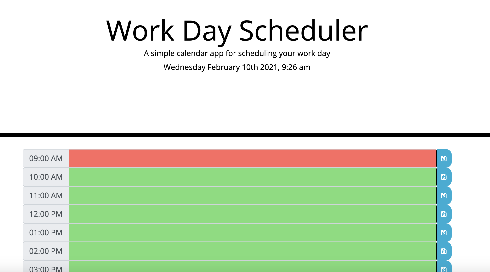

# Work_Day_Scheduler
Homework 5 Third-Party APIs: Work Day Scheduler

* https://github.com/lindseybowen/Work_Day_Scheduler

Summery:
    For homework 5 was asked to creat a simple calendar application that allows a user to save events for each hours of the work day. The app will run in the browser and feature dynamically updated HTML and CSS powered by JQuery. 

    Will also be using Moment.js or other alternative (Luxon, Day.js, date-fns, js-Joda). 

Application Function: 
    When you open the application the date and time of the current day will be desplayed at the top under title. Once you scroll down you will see time blocks that when you type in the block it will change colors. Grey for past, Red for present and green for future. Once you enter an event you can click on the save button and that event will be saved in local storage.

* https://lindseybowen.github.io/Work_Day_Scheduler/

# Screen Shots

    
    
